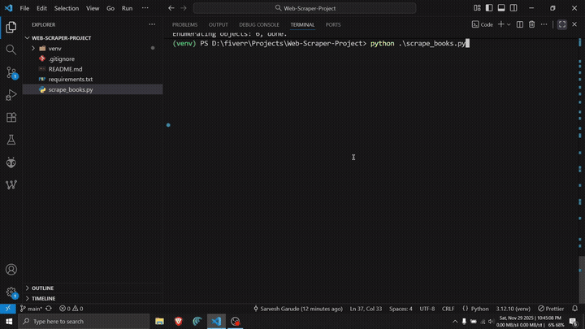

# 📚 E-commerce Data Scraper (Python)

A high-performance web scraper built with **Python**, **BeautifulSoup**, and **Pandas**. 

This script automates the extraction of product data (Title, Price, Rating, Stock Status) from e-commerce sandbox environments and exports clean, structured data for market analysis.



## 🚀 Features

- **Automated Extraction:** Scrapes hundreds of products in seconds.
- **Data Cleaning:** Automatically removes currency symbols and formats text.
- **Excel Export:** Saves data to a structured `.xlsx` file using Pandas.
- **Error Handling:** Robust connection checks to prevent crashes.

## 🛠️ Tech Stack

- **Python 3.10+**
- **BeautifulSoup4** (HTML Parsing)
- **Pandas** (Data Formatting & Export)
- **Requests** (HTTP Protocol)

## ⚙️ How to Run

1. **Clone the repository:**
   ```bash
   git clone [https://github.com/Sarveshyg/web-scraper-books.git](https://github.com/Sarveshyg/web-scraper-books.git)
   cd web-scraper-books
   ```
